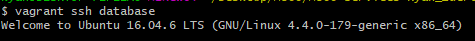
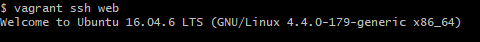
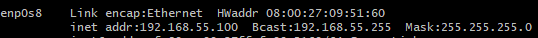
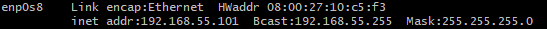
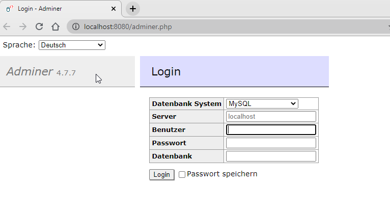

# M300-Services-Kyan_Zuercher
## Hier werden die Dokumentation / Wissenstände und Tipps & Tricks eingetragen. 
---
**Persönlicher Wissenstand**
* Linux

    * Im Bereich Linux ist mein Wissenstand ziemlich gross, denn wir haben bereits viele Modul hinteruns die mit Linux zutun hatten. Ich habe Erfahrung mit Ubuntu, CentOS, Rasperry Pi und ein bisschen Kalilinux. Viele Befehle die ich bereits in anderen Aufgaben gebraucht habe können hier auch sehr gut verwendet werden. In Vagrant weiss ich bereits das man in der Konfiguration einige Befehle verwenden wird.
* Virtualisierung

    * In der Virtualisierung habe ich bis jetzt nicht viel Erfahrung gesammelt, denn in unserem Betrieb habe ich bereits nicht viel von dem mitbekommen, obwohl es ein grosses Thema ist. Wird wahrscheinlich noch kommen. Einige der Virtualisierungssoftware kommen mir bekannt vor wie z. B. Azure. 
* Git

    * Mit Git selbst habe ich noch keine Erfahrungen gemacht, ausser wenn es mal Probleme mit einer Aufgabe gab, meist dann aber in den Forum von [Stackoverflow][1]. 
* Mark Down

    * Mit Mark Down habe ich nicht viel gemacht bis jetzt, jedoch ist es für mich ziemlich simpel eine "Live-Darstellung" vom ganzem Dokument, somit sehr praktisch.

* Systemsicherheit

    * Es gibt viele Systemsicherheiten die man mit Vagrant und Git hat, denn es ist auch wichtig das man diese Sicherheit hat. In Vagrant selbst hat man die Möglichkeit alle Passwort zu schützen oder auch im Internet Sicherheit zu gewährleistet mit einer Firewall. Auf Git hat man nur die Möglichkeit änderungen zu machen, wenn der Benutzer auch wirklich Berechtigung hat.
---
**Versionverwaltung**
| Version| Kommentar| 
| ------ | ----------- |
| Version 1  | Persönlicher Wissenstand eingefügt |
| Version 2 | Design & Wichtige Lernschritte (Git) eingefügt |
| Version 3   | Wichtige Lernschritte (Vagrant) eingefügt & Befehle |
| Version 4   | Dokumentation Umgebung (Netzwerkplan, Sicherheitsaspekte usw.)|
| Version 5   | Dokumentation weitergemacht & Screenshots eingefügt|
| Version 6   | Design überarbeitet & Sicherheitaspekte eingefügt|
---
**Wichtige Lernschritte**

Es gibt einige wichtige Schritte die während der Installation und der Konfiguration gebraucht wurden:


`Git`

Ich musste zuerste die "Basics" lernen wie z. B. etwas "Commiten" und "pushen", sodass es auf der Github-Seite angezeigt wird.
```
git commit -a "Kommentar" <Filename>
git push
git status
```
Der Commit Befehl lädt alle die Daten und der Push Befehl kopiert es auf die Gitseite. Der Gitstatus ist auch ein sehr wichtiger Befehl, denn mit diesem kann man immer überprüfen, ob es noch Probleme gibt.

`Vagrant`

Natürlich gibts in Vagrant auch viele wichtige Schritte die ich gelernt habe und zwar:
```
vagrant up
vagrant status
vagrant ssh <Name>
vagrant halt -f
vagrant destroy -f
```
Der "Vagrant up" Befehl erstellt die VM's die im Vagrantfile angegeben sind. Das Erstellen der VM's dauert eine gewisse Zeit. Danach sollte man mit dem "Vagrant Status", denn Status überprüfen, ob alles einwandfrei funktioniert hat. Mit dem Befehl "Vagrant ssh <Name der VM>" kann man direkt eine Verbindung per SSH aufbauen, danach kann man alle Information von der VM beziehen wie z. B. die OS Version der zugewiesene Port für die Webseite usw. Der Befehl "Vagrant halt -f" schaltet alle VM's aus, sprich fährt sie herunter. Der "Vagrant destroy -f" löscht alle erstelle VM's durch Vagrant, somit ist es sehr einfach alle wieder zu löschen.

---
**Dokumentation Umgebung**

`Umgebungs-Variablen`

Eine Umgebungs-Variable ist eine konfiguierbare Variable in einem Betriebssystem, die meist Pfade zu bestimmen Programme oder Daten enthalten. 


`Netzwerkplan`


    +---------------------------------------------------------------+
    ! Notebook - Privates Netz 192.168.55.1 !                 
    ! Port: 8080 (192.158.55.101:80)                                !	
    !                                                               !	
    !    +--------------------+          +---------------------+    !
    !    ! Web Server         !          ! Datenbank Server    !    !       
    !    ! Host: web01        !          ! Host: db01          !    !
    !    ! IP: 192.168.55.101 ! <------> ! IP: 192.168.55.100  !    !
    !    ! Port: 80           !          ! Port 3306           !    !
    !    ! Nat: 8080          !          ! Nat: -              !    !
    !    +--------------------+          +---------------------+    !
    !                                                               !	
    +---------------------------------------------------------------+
	
---

`Beschreibung`


* Web Server mit Apache und MySQL UserInterface [Adminer](https://www.adminer.org/)
* Datenbank Server mit MySQL
    * Das MySQL User Interface ist via [http://localhost:8080/adminer.php](http://localhost:8080/adminer.php) mit User/Password: root/admin erreichbar.

* Die Verbindung Web - Datenbank erfolgt mittels Internen Netzwerk Adapter.
* Von Aussen ist nur der HTTP Port auf dem Web Server Erreichbar.

----

`Tests`


* Erstes Testfall 
    * Wir überprüfen, als erstes, ob wir eine SSH-Verbindung auf die machen können auf die VM's.
    
    Zuerst auf dem Datenbank-Server:

    

    Nun auf dem Web-Server:

    

    **Test erfolgreich!**

---

* Zweiter Testfall
    * Wir wollen natürlich auch überprüfen, ob die IP-Adresse bei den verschiedenen VM's stimmt.

    Zuerst auf dem Datenbank-Server wieder:

    

    Natürlich auch auf dem Web-Server:

    

    **Test erfolgreich!**

---

* Dritter Testfall
    * Nun testen wir, ob wir auf die verschiedene Services zugreifen können.

    Wir können beides in einem testen, da die Datenbank auf der Webseite vom Web-Server läuft.

    

    **Test erfolgreich!**

---

`Sicherheit`

* Datenbank Server bzw. MySQL ist mit Password geschützt.
* Der Web Server ist offen und mittels ungeschütztem HTTP Protokoll erreichbar.
* Es wurde auf den VM's eine Firewall inkl. Rules eingerichtet. 
* Eine Reverse-Proxy wurde ebenso eingerichtet. 
* Benutzer- und Rechtvergaben wurden auf den verschiedenen VM's installiert. 
* Der Zugang per SSH wird gesichert, sodass eine Sichere Verbindung steht.


[1]: https://stackoverflow.com/ "Stackoverflow"